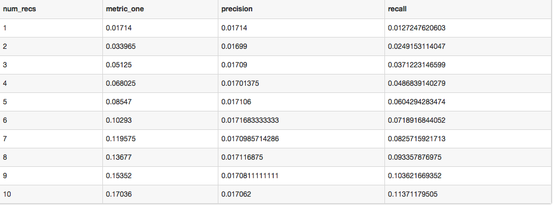

# coding-assignment

## Approach
This solution was designed to be modular, reusable, and tolarant of changes to the input data sets. `metric_calculator` is implemented such that it can be imported and integrated into a production system as-is. I started with an exploratory ipython notebook session (exploratory.ipynb) and designed the algorithm and architechture based on what I discovered there.

Assumes installation of pandas and numpy.

## How to Run It:
To run the process end-to-end on the dataset provided, simply execute the runner script that instantiates and runs metric_calculator:
  ```
  python runner.py
  ```
In order to run the process on a smaller subset of the full dataset (20 customers) pass `True` to the flag `-rs`, and in order to save the processed dataframe used to calculate the output, pass `True` to the flag `-s`, as follows:
  ```
  python runner.py -rs True -s True
  ```

## Algorithm:
There are three main parts to this algorithm: Creation of the purchase dictionary, transformation on the recommendation data frame, and metric calculation. These processes are orchestrated by the `run()` function in the `MetricCalculator` class.

#### Creation of the purchase dictionary
The module starts by creating a dictionary with each customer as the key and a list of product_ids they have purchased as the value. This process iterates through each unique customer id to find their purchases in the test file.

Example:
```python
{1: ['XXXXXXX', 'YYYYYYY', 'ZZZZZZZ'],
 2: ['XXXXXXX],
 3: [],
 4: ['XXXXXXX', 'ZZZZZZZ'],
 ...}
```
#### Transformation on the recommendation data frame

This process is designed to only iterate through the recommendations file once, and performs all of it's calculations in the same iteration. While this can be implemented as an apply function - and the subprocess functions are written such that you can use them in an apply function - that drasticly increases the computational cost.  On each iteration / row of the recommendations dataframe, it:
  1. calculates the number of purchases made by this customer that weren't recommended
  2. replaces the product id in each recomendation column with an indicator variable, denoting whether or not the customer bought the recommended item

So this...

|customer_id|1|2|3|4|5|6|7|8|9|10|
|:---:|:---:|:---:|:---:|:---:|:---:|:---:|:---:|:---:|:---:|:---:|
1110|"XXXXXX"|"XXXXXX"|"XXXXXX"|"XXXXXX"|"XXXXXX"|"XXXXXX"|"XXXXXX"|"XXXXXX"|"XXXXXX"|"XXXXXX"|

... becomes this:

|customer_id|1|2|3|4|5|6|7|8|9|10|num_purs_not_recommended|total_purchased|
|:---:|:---:|:---:|:---:|:---:|:---:|:---:|:---:|:---:|:---:|:---:|:---:|:---:|
|1110|0|0|0|1|0|0|1|0|0|0|3|5|

The resulting dataframe can be saved if the `-s True` flag is passed to runner.py

#### Metric calculation
Finally, the metric calcualtions are executed iteratively for each number of recommendations, from 10-1. At each iteration, the `num_recs` variable is decremented, and the corresponding column is dropped from the transformed dataframe. The total purchases column is updated accordingly, and the metrics are calculated again at this level of recommendations.

## Project Organization
Files & Directories:
  1. runner.py Script that instantiates and runs metric_calculator.MetricCalculator object
  2. metric_calculator.py - heart of the module, imports the other files functions and classes and orchestrates/executes process
  3. file_constants.py - file classes that contain all the constants for each file
  4. calc_util.py - file of reusable utility functions
  5. coding_test_data - directory where both the full and subset data sets are stored
  6. full_output.txt - output when process is run on the full data set
  7. target - directory where timestamped files are saved, containing the processed dataframe from that run if --save is True

## Next Steps:
With more time, I would have liked to implement the following things, in order:
  1. Create testing suite with unit tests for every function, especially those that calculate the metrics
  2. Optimize creation of purchase dictionary with more complicated sorting and indexing logic, to avoid repeated subsetting of the dataframe.
  3. Optimize the dataframe transformation process similiarly.
  4. Parallelize both of these processes. Since they are designed to operate independently on an individual row of the dataframe, there's no reason why it can't be implemented with chunking and multithreading.
  5. 
  
## Results on Full Dataset:

